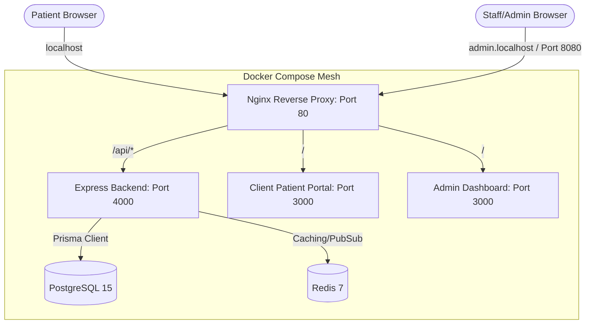

# 🏥 ClinicMS: Physiotherapy Clinic Management System

[](https://opensource.org/licenses/MIT)
[](https://nodejs.org/)
[](https://www.postgresql.org/)
[](https://redis.io/)
[](https://www.docker.com/)

**ClinicMS** is a production-grade, multi-tenant Software-as-a-Service (SaaS) Clinic Management System designed specifically for **Physiotherapy and Rehabilitation Clinics**. Built with a modern, high-performance tech stack (Next.js, Express, Prisma ORM, PostgreSQL, Redis, Docker, and Nginx), it provides clinics with comprehensive tools to manage subscriptions, staff, patient records, treatment plans, clinical sessions, and appointments under isolated tenant environments.

---

## 🏗️ System Architecture

ClinicMS uses a containerized multi-service architecture orchestrated via **Docker Compose** and routed through **Nginx** as a reverse proxy. 



### Routing Rules (Nginx)
*   **Patient Portal (Next.js)**: Accessed via `http://localhost/` (proxied to the `client` service).
*   **Staff/Admin Portal (Next.js)**: Accessed via `http://admin.localhost/` or `http://localhost:8080` (proxied to the `admin` service).
*   **Shared REST API (Express)**: Accessed via `/api/` on either entrypoint (proxied to the `server` service).

---

## 🌟 Core Features

### 🏢 Multi-Tenant SaaS Engine
*   **Subdomain Isolation**: Each clinic registers with a unique code (e.g., `tmj`), automatically provisioning a subdomain (`tmj.localhost`).
*   **Subscription Lifecycle**: Subscriptions support tiered billing intervals (`MONTHLY`, `ANNUAL`), dynamic trial periods, and status controls (`ACTIVE`, `TRIAL`, `ENDED`).
*   **Platform Ledger**: Super Admin dashboard to log, monitor, and audit system-wide payments (`platform_payments`).

### 👥 Unified Role-Based Access Control (RBAC)
*   Unified database mapping for staff roles under `OWNER`, `DOCTOR`, and `RECEPTION`.
*   **Automated Staff & Patient Codes**: Auto-generated sequential tracking codes scoped per clinic and role (e.g., `TMJ-ADM-001` for owners, `TMJ-DTR-002` for doctors, and `TMJ-PAT-003` for patients).
*   **Assigned Doctor Relationships**: Establish direct links between patients and primary practitioners.

### 📝 Clinical Record Keeping & Intake
*   **Consultation Intake Notes**: Standardized initial assessment forms capturing chief complaints, diagnosis, and rich-text clinical impressions.
*   **Treatment Plans**: Define recommended session counts per patient and track real-time progress (completed vs. remaining sessions).

### ⚡ Physiotherapy Session & Billing Management
*   **Clinical Session Logs**: Tracks duration, date, detailed clinical notes, and treatment methods.
*   **Treatment Array**: Supports multiple concurrent therapy types per session:
    *   *Electrotherapy, Manual Therapy, Heat Therapy, Acupuncture, Gym Exercises, Stretching, Chiropractic, and custom treatments.*
*   **Session Billing**: Supports direct session fee collection, payment method registration (`BANK_TRANSFER`, `CASH`, `OTHER`), and transaction references.

### 📅 Online Scheduling & Approvals
*   Patients can submit appointment requests specifying preferred dates, times, and preferred doctors.
*   Receptionists and doctors approve, reschedule, or cancel requests, automatically provisioning treatment session stubs upon approval.

### 🔒 Enterprise Security & Reliability
*   **PII Encryption at Rest**: Sensitive data (such as CNIC details) is handled securely.
*   **Dual-Layer Auth**: JSON Web Tokens (JWT) with persistent `refresh_tokens` for all actors (`staff`, `patient`, `superAdmin`).
*   **Cascade Soft-Deletes**: Soft-delete triggers for clinics, patients, and staff to maintain database reference integrity.

---

## 🛠️ Technology Stack

| Component | Technology | Version / Key Details |
| :--- | :--- | :--- |
| **Client Frontend** | [Next.js](https://nextjs.org/) | TypeScript, React 19, Tailwind CSS v4 |
| **Admin Dashboard** | [Next.js](https://nextjs.org/) | TypeScript, React 19, Tailwind CSS v4 |
| **Backend API** | [Node.js](https://nodejs.org/) & [Express](https://expressjs.com/) | ES Modules, TypeScript declarations, Nodemon |
| **Database ORM** | [Prisma](https://www.prisma.io/) | Schema version 7.8, custom client outputs |
| **Database** | [PostgreSQL](https://www.postgresql.org/) | Version 15-alpine, persistent volumes |
| **Caching Layer** | [Redis](https://redis.io/) | Version 7-alpine, cache-aside strategy |
| **Server Validation** | [Zod](https://zod.dev/) | Strict runtime schemas |
| **Reverse Proxy** | [Nginx](https://www.nginx.com/) | Static routing, gzip compression, request routing |
| **Development Utility**| [Concurrently](https://www.npmjs.com/package/concurrently) | Parallel local service bootstrapping |

---

## 📂 Project Structure

```text
clinicMS/
├── admin/                 # Next.js 15/16 admin dashboard (Next App router)
├── client/                # Next.js 15/16 patient portal (Next App router)
├── server/                # Express backend application
│   ├── src/
│   │   ├── config/        # Environment and DB config
│   │   ├── guards/        # Auth validation guards
│   │   ├── middlewares/   # Express middlewares (Errors, Logging)
│   │   ├── modules/       # Domain-driven backend modules
│   │   ├── prisma/        # Database schema config (schema.prisma)
│   │   ├── services/      # Business logic services
│   │   └── server.js      # App entrypoint
│   └── Dockerfile
├── nginx/                 # Nginx config files for routing & proxy
├── docker-compose.yml     # Multi-container orchestrator configuration
├── package.json           # Root package manager (monitored dev tasks)
└── README.md              # Documentation
```

---

## 🚀 Getting Started

### Prerequisites
*   [Node.js](https://nodejs.org/) (Version `>= 18.0.0`)
*   [NPM](https://www.npmjs.com/) (Version `>= 9.0.0`)
*   [Docker Desktop](https://www.docker.com/products/docker-desktop/) (Required for containerized setup)

---

### Method 1: Containerized Startup (Recommended)

To run the entire suite (PostgreSQL, Redis, Express backend, Client frontend, Admin dashboard, Nginx) inside Docker:

1.  **Clone the Repository**:
    ```bash
    git clone https://github.com/your-username/clinicMS.git
    cd clinicMS
    ```

2.  **Environment Variables**:
    By default, the `docker-compose.yml` is pre-configured with default credentials. You can copy the example configuration in the server directory:
    ```bash
    cp server/.env.example server/.env.local
    ```

3.  **Spin Up Containers**:
    Run the root script to build and bring up the container grid:
    ```bash
    npm run docker:up
    ```
    *Alternatively, run `docker compose up --build -d` directly.*

4.  **Local Host File Configuration (Optional but Recommended)**:
    To access the admin panel via `http://admin.localhost`, map the subdomain by editing your hosts file:
    *   **Windows**: `C:\Windows\System32\drivers\etc\hosts`
    *   **Mac/Linux**: `/etc/hosts`
    
    Add the following entry:
    ```text
    127.0.0.1 admin.localhost
    ```
    If you choose not to configure hosts, you can fallback to:
    *   **Patient Portal**: `http://localhost/`
    *   **Admin Portal**: `http://localhost:8080/`

5.  **Stop and Clean Containers**:
    ```bash
    # Stop services
    npm run docker:down
    
    # Remove containers and clean database/cache volumes
    npm run docker:clean
    ```

---

### Method 2: Running Locally without Docker

If you prefer to run services individually in your local environment:

1.  **Set Up Local PostgreSQL and Redis**:
    Ensure local instances of PostgreSQL (Port 5432) and Redis (Port 6379) are active.
    
2.  **Configure Local Environment Variables**:
    Create `server/.env.local` with the following variables:
    ```env
    BACKEND_PORT=4000
    DATABASE_URL="postgresql://<username>:<password>@localhost:5432/clinicms?schema=public"
    REDIS_URL="redis://localhost:6379"
    ```

3.  **Install Dependencies Across All Projects**:
    From the root directory, run the installer script:
    ```bash
    npm run install:all
    ```

4.  **Database Migration & Client Generation**:
    Deploy the database schema using Prisma:
    ```bash
    cd server
    npx prisma migrate dev
    ```

5.  **Run Development Server**:
    From the root folder, launch all services concurrently (Server, Admin panel, Patient Client):
    ```bash
    npm run dev
    ```
    *This runs:*
    *   Express Server: `http://localhost:4000`
    *   Client App: `http://localhost:3000` (or next free port)
    *   Admin App: `http://localhost:3001` (or next free port)

---

## 🛠️ Database Administration & Prisma Commands

Navigate to the `server/` directory to manage the database schema:

*   **Create a new migration**:
    ```bash
    npx prisma migrate dev --name <migration_name>
    ```
*   **Regenerate the Prisma client**:
    ```bash
    npx prisma generate
    ```
*   **Open Prisma Studio (Visual DB Interface)**:
    ```bash
    npx prisma studio
    ```

---

## 📜 License

This project is licensed under the [MIT License](LICENSE) - see the `package.json` file for authorization details.

---

*Developed by [Zafar Rizvi](https://github.com/your-github-username).*
